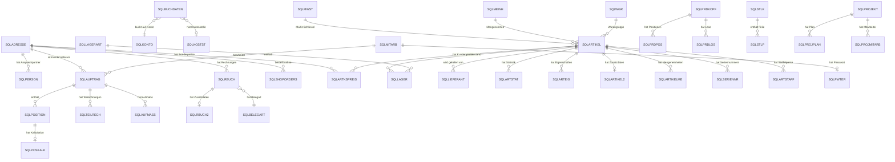

# Legacy-Datenbank Relationen & Datenqualität — Becker Sicherheitstechnik

> **Generiert:** 2026-02-10 15:33 UTC
> **Datenbank:** InterBase → Firebird 4.0 (`USDB.fdb`)

---

## 1. Formale Fremdschlüssel (FK Constraints)

> ⚠️ **Die Datenbank enthält KEINE formalen Foreign Key Constraints!**
> Alle Beziehungen sind rein über Namenskonventionen und Anwendungslogik implementiert.
> Dies ist typisch für ältere InterBase/Delphi-Anwendungen.

## 2. Primary Keys

| Tabelle | Primary Key Spalte(n) |
|---------|----------------------|
| SQLADRESSE | `ADRESSNR` |
| SQLADRESSKONTO | `BELEGART`, `BELEGNR`, `LFDBUCHNR` |
| SQLADRRECHART | `ZNR` |
| SQLAPSK | `ARTNR`, `AGNR` |
| SQLARTEIG | `ARTIKELNR` |
| SQLARTFILTERVORL | `ARTKATEGORIE`, `FILTERBEZ`, `PARAMNR` |
| SQLARTIKEL | `ARTIKELNR` |
| SQLARTIKEL2 | `ARTIKELNR` |
| SQLARTIKELDIMS | `ARTIKELNR`, `ARTDIM` |
| SQLARTIKELKALKULATION | `ARTIKELNR` |
| SQLARTIKELLANG | `IDENTNR` |
| SQLARTIKELME | `ARTIKELNR`, `ZNR` |
| SQLARTIKELPARAMS | `ARTIKELNR`, `PCOUNTER` |
| SQLARTIKELPARBEZ | `ZNR` |
| SQLARTKSPREIS | `ARTNR`, `ADRNR` |
| SQLARTLEASING | `ARTIKELNR`, `ADRESSNR`, `ZAEHLER` |
| SQLARTLOSMESSPLAN | `PRODNR`, `ETNR`, `LOSNR`, `TEILNR`, `CHARGE`, `ARTNR`, `MPLNR` |
| SQLARTPPLAN | `ARTNR`, `PPLNR`, `PRUEFAGNR` |
| SQLARTSTAFF | `ARTNR`, `MENGE` |
| SQLARTSTAMMMESSPLAN | `ARTNR`, `MPLNR` |
| SQLARTSTAT | `BELEGNR`, `BELEGART`, `KZ` |
| SQLAUFMASS | `VORGANG`, `KZINT`, `SATZNR` |
| SQLAUFMASSP | `VORGANG`, `KZINT`, `STLPOS` |
| SQLAUFTRAG | `VORGANG`, `BELEGART` |
| SQLAZPLAN | `AZPID`, `AZPABNR` |
| SQLBANK | `KONTO`, `PERIODE`, `BUCHNR` |
| SQLBDEBUCHUNG | `SATZNR` |
| SQLBELEGART | `BELEGART` |
| SQLBELEGKATEG | `ZAEHLER` |
| SQLBON0101 | `POS` |
| SQLBON0102 | `POS` |
| SQLBON0103 | `POS` |
| SQLBON0104 | `POS` |
| SQLBON0105 | `POS` |
| SQLBON0106 | `POS` |
| SQLBON0107 | `POS` |
| SQLBON0108 | `POS` |
| SQLBON0109 | `POS` |
| SQLBON0110 | `POS` |
| SQLBON0111 | `POS` |
| SQLBON0121 | `POS` |
| SQLBON0122 | `POS` |
| SQLBON0131 | `POS` |
| SQLBONRAB | `BONNR` |
| SQLBUCHDATEN | `ZNR` |
| SQLBUCHTEXT | `TEXTNR` |
| SQLCALENDAR | `JJJJMMTT`, `MITARB`, `REGION`, `MASCHINE` |
| SQLCALPOS | `JJJJMMTT`, `MITARB`, `REGION`, `MASCHINE`, `STMIN` |
| SQLCNCPROG | `ARTIKELNR`, `MASCHINENNR`, `PROGRAMMNR` |
| SQLCNCWERKZEUG | `ARTIKELNR`, `MASCHINENNR`, `PROGRAMMNR`, `LFDNR` |
| SQLDOKUMENT | `DOKUNR` |
| SQLDOKUSTRUK | `LFDNR` |
| SQLDOKUVERZ | `DV_KZ` |
| SQLDRUCKER | `BELEGART`, `BSNR` |
| SQLDRUCKFUNKTS | `LFDNR` |
| SQLEREIGNISSE | `ZNR` |
| SQLETIKFORMS | `LFDNR` |
| SQLETIKPAPIER | `LFDNR` |
| SQLETIKSTEUER | `IDENT` |
| SQLFASTMAPLAN | `ARTNR`, `FPLNR`, `AGNR` |
| SQLFBUCH | `LFDNR` |
| SQLFORMULAR | `LFNDNR` |
| SQLHLTEMP | `KDNR` |
| SQLINFO | `INFONR` |
| SQLINVELK | `KDNR`, `INVNR`, `PRUEFID` |
| SQLINVENTAR | `KDNR`, `INVNR` |
| SQLINVENTUR | `INVNR` |
| SQLKASBER | `NR` |
| SQLKASJB | `JAHR` |
| SQLKASSEHIST | `KANR`, `DATUM`, `ZEIT` |
| SQLKONTAKTVOR | `ZNR` |
| SQLKONTO | `KONTO` |
| SQLKOSTST | `KOSTENSTELLE` |
| SQLKSLAGART | `KDNR`, `LAGNR` |
| SQLKSLAGER | `ARTNR`, `KDNR`, `LAGNR` |
| SQLLAGER | `ARTIKELNR`, `LAGERNR` |
| SQLLAGERART | `LAGERNR` |
| SQLLAGERRESVG | `LFDNR` |
| SQLLAGERSNR | `ARTIKELNR`, `LGNR`, `SERIALNO` |
| SQLLAGMINMAX | `LFNDNR` |
| SQLLAGRESVG | `CREATETIME` |
| SQLLAGSTAT | `LFNDNR` |
| SQLLIEFERANT | `ARTIKELNR`, `LIEFERNR` |
| SQLLIEFERBED | `LBEDNR` |
| SQLLOHNGR | `LOHNGRUPPE` |
| SQLMAHNUNG | `BELEGART`, `BELEGNR`, `UBELEGNR` |
| SQLMANDANT | `MANDNR` |
| SQLMASCHINE | `MASCHNR` |
| SQLMEINH | `MEINHEIT` |
| SQLMENGENKONTRAKT | `ARTIKELNR`, `LAGERNR` |
| SQLMESSMITTEL | `ARTIKELNR`, `MMSERNR` |
| SQLMETRICS | `ZNR` |
| SQLMITARB | `MITARBNR` |
| SQLMWST | `SCHLNR` |
| SQLOBJEKT | `LFDNR` |
| SQLOBJHISTART | `PHARTKZ` |
| SQLORDERLIST | `CREATETIME` |
| SQLPABK | `PRODNR`, `ETNR`, `LOSNR`, `ARTNR`, `AGNR` |
| SQLPERSON | `ADRESSNR`, `LFDNR` |
| SQLPFORMEL | `PFNR` |
| SQLPOSART | `PART` |
| SQLPOSITION | `VORGANG`, `POSNR` |
| SQLPOSKALK | `VORGANG`, `KZINT` |
| SQLPRDET | `PRODNR`, `ETNR` |
| SQLPRDKOPF | `PRODNR`, `BELEGART` |
| SQLPRDLOS | `PRODNR`, `ETNR`, `LOSNR` |
| SQLPRDPOS | `PRODNR`, `POSNR` |
| SQLPRDQS | `PRODNR`, `ETNR`, `LOSNR`, `ARTNR`, `AGNR`, `ZNR` |
| SQLPRFORMEL | `PREISFNR`, `PREISFZN` |
| SQLPRODDOC | `PRODNR`, `BELEGART`, `DOKUNR` |
| SQLPROJANSPRP | `PROJEKTNR`, `ZAEHLER` |
| SQLPROJECT | `PROJECTNR` |
| SQLPROJEKT | `PROJEKTNR` |
| SQLPROJHOTEL | `PROJEKTNR`, `ZAEHLER`, `HOTELNR` |
| SQLPROJMASCH | `PROJEKTNR`, `ZAEHLER`, `MASCHNR` |
| SQLPROJMITARB | `PROJEKTNR`, `ZAEHLER`, `MANR` |
| SQLPROJPLAN | `PROJEKTNR`, `ZAEHLER` |
| SQLPROJPLART | `PROJPLANART` |
| SQLPRUEFABL | `ARTNR`, `CHARGENNR`, `TEILNR`, `PPLNR`, `PRUEFAGNR` |
| SQLPWTER | `MITARBNR` |
| SQLRABATTGR | `LIEFERANT`, `RABGR` |
| SQLRBUCH | `BELEGART`, `BELEGNR`, `UBELEGNR` |
| SQLRBUCH2 | `BELEGART`, `BELEGNR`, `UBELEGNR` |
| SQLREBUCHERFA | `MITARBEITER`, `BELEGART`, `BELEGNR`, `UBELEGNR` |
| SQLRECMASSES | `IDNO` |
| SQLREGIONS | `REGIONS` |
| SQLREZEPTKOPF | `IDNR`, `ZNR` |
| SQLREZEPTPOS | `IDNR`, `ZNR`, `POSNR` |
| SQLSEPAS | `LFDNR` |
| SQLSERIENNR | `ARTIKELNR`, `LFDNR` |
| SQLSHOPORDERS | `ARCHIV`, `IDSHOP` |
| SQLSTLK | `STLNR` |
| SQLSTLP | `STLNR`, `POSNR` |
| SQLTEAMNAMES | `NAMENO` |
| SQLTEILRECH | `VORGANG`, `BELEGART`, `BELEGNR` |
| SQLUMSATZ | `JAHR` |
| SQLVERSAND | `VARTNR` |
| SQLVORSTSCHL | `VSTSCHL` |
| SQLWAEHRG | `NUMMER` |
| SQLWARTGZAEHL | `LFDNRZ` |
| SQLWARTUNG | `LFDNR` |
| SQLWGR | `LIEFERANTNR`, `WARENGRUPPE` |
| SQLWTLBOOK | `IDNO` |
| SQLWTLDATA | `BUCHGNR` |
| SQLWTLPLANING | `WTLPID` |
| SQLWTPLAN | `WTPLAN` |
| SQLZAHLBED | `ZZNR` |
| SQLZAHLUNG | `LFDNR` |
| SQLZUGRIFF | `ZNR` |

---

## 3. Implizite Relationen (Namenskonventionen)

Da keine FK-Constraints existieren, sind alle Beziehungen über gleichnamige Spalten realisiert:

### Beziehungsübersicht

| Verknüpfungsspalte | Zieltabelle (PK) | Referenzierende Tabellen |
|--------------------|-------------------|--------------------------|
| `ADRESSNR` | SQLADRESSE.ADRESSNR | SQLAUFTRAG, SQLPERSON, SQLRBUCH, SQLBUCHDATEN, SQLSHOPORDERS, SQLARTLEASING, SQLARTKSPREIS (als ADRNR) |
| `ARTIKELNR` | SQLARTIKEL.ARTIKELNR | SQLPOSITION (als POSIDENT), SQLLAGER, SQLLIEFERANT, SQLARTEIG, SQLARTIKEL2, SQLARTIKELDIMS, SQLARTIKELKALKULATION, SQLARTIKELME, SQLARTIKELPARAMS, SQLSERIENNR, SQLLAGERSNR, SQLMENGENKONTRAKT, SQLMESSMITTEL, SQLCNCPROG, SQLCNCWERKZEUG |
| `VORGANG` | SQLAUFTRAG.VORGANG | SQLPOSITION, SQLPOSKALK, SQLTEILRECH, SQLAUFMASS, SQLAUFMASSP |
| `BELEGART` | SQLBELEGART.BELEGART | SQLAUFTRAG, SQLPOSITION (implizit via VORGANG), SQLRBUCH, SQLRBUCH2, SQLBUCHDATEN, SQLTEILRECH, SQLARTSTAT, SQLMAHNUNG, SQLPRDKOPF, SQLSHOPORDERS, SQLADRESSKONTO |
| `BELEGNR` | Belegspezifisch (kein einzelner FK) | SQLAUFTRAG, SQLRBUCH, SQLBUCHDATEN, SQLTEILRECH, SQLARTSTAT, SQLMAHNUNG, SQLSHOPORDERS |
| `MITARBNR / MITARB / MANR` | SQLMITARB.MITARBNR | SQLAUFTRAG (als MITARB), SQLPWTER, SQLPROJMITARB (als MANR), SQLREBUCHERFA (als MITARBEITER), SQLCALENDAR (als MITARB) |
| `LAGERNR` | SQLLAGERART.LAGERNR | SQLLAGER, SQLMENGENKONTRAKT, SQLKSLAGART, SQLKSLAGER |
| `PRODNR` | SQLPRDKOPF.PRODNR | SQLPRDPOS, SQLPRDLOS, SQLPRDET, SQLPRDQS, SQLPABK, SQLARTLOSMESSPLAN, SQLPRODDOC |
| `PROJEKTNR` | SQLPROJEKT.PROJEKTNR | SQLPROJPLAN, SQLPROJMITARB, SQLPROJMASCH, SQLPROJHOTEL, SQLPROJANSPRP |
| `STLNR` | SQLSTLK.STLNR | SQLSTLP |
| `DOKUNR` | SQLDOKUMENT.DOKUNR | SQLAUFTRAG, SQLPRODDOC |
| `KOSTENSTELLE / KOSTENST / KOSTST` | SQLKOSTST.KOSTENSTELLE | SQLAUFTRAG (als KOSTENST), SQLBUCHDATEN (als KOSTST) |
| `KONTO` | SQLKONTO.KONTO | SQLBUCHDATEN, SQLBANK |
| `WARENGRUPPE` | SQLWGR.WARENGRUPPE | SQLARTIKEL |
| `MEINHEIT / MEINH / MENGENEINHEIT` | SQLMEINH.MEINHEIT | SQLARTIKEL (als MENGENEINHEIT), SQLPOSITION (als MEINH) |
| `SCHLNR / MWST` | SQLMWST.SCHLNR | SQLARTIKEL (als MWST), SQLPOSITION (als MWST) |

### Beziehungstypen

| Beziehung | Typ | Beschreibung |
|-----------|-----|--------------|
| SQLADRESSE → SQLPERSON | 1:N | Eine Adresse hat mehrere Ansprechpartner |
| SQLADRESSE → SQLAUFTRAG | 1:N | Ein Kunde hat mehrere Aufträge |
| SQLAUFTRAG → SQLPOSITION | 1:N | Ein Beleg hat mehrere Positionen |
| SQLAUFTRAG → SQLTEILRECH | 1:N | Ein Auftrag hat mehrere Teilrechnungen |
| SQLAUFTRAG → SQLRBUCH | 1:N | Ein Auftrag erzeugt Rechnungsbuch-Einträge |
| SQLARTIKEL → SQLLAGER | 1:N | Ein Artikel liegt in mehreren Lagern |
| SQLARTIKEL → SQLLIEFERANT | 1:N | Ein Artikel hat mehrere Lieferanten |
| SQLARTIKEL → SQLARTKSPREIS | 1:N | Ein Artikel hat kundenspez. Preise |
| SQLARTIKEL → SQLARTSTAT | 1:N | Statistik pro Artikel/Beleg |
| SQLPRDKOPF → SQLPRDPOS | 1:N | Produktionsauftrag hat Positionen |
| SQLPROJEKT → SQLPROJPLAN | 1:N | Projekt hat Planungseinträge |
| SQLSTLK → SQLSTLP | 1:N | Stückliste hat Positionen |
| SQLPOSITION → SQLPOSKALK | 1:1 | Jede Position hat eine Kalkulation |

---

## 4. ER-Diagramm (Mermaid)

### Kern-Entitäten



### Vereinfachtes Datenfluss-Diagramm

```
┌──────────────┐     ┌──────────────┐     ┌──────────────┐
│  SQLADRESSE  │────▶│  SQLAUFTRAG   │────▶│ SQLPOSITION  │
│  (34.075)    │     │  (270.533)    │     │  (917.937)   │
└──────┬───────┘     └──────┬───────┘     └──────┬───────┘
       │                    │                     │
       ▼                    ▼                     ▼
┌──────────────┐     ┌──────────────┐     ┌──────────────┐
│  SQLPERSON   │     │   SQLRBUCH    │     │  SQLPOSKALK  │
│  (20.851)    │     │  (175.389)    │     │  (983.408)   │
└──────────────┘     └──────┬───────┘     └──────────────┘
                            │
                            ▼
┌──────────────┐     ┌──────────────┐     ┌──────────────┐
│  SQLARTIKEL  │────▶│ SQLBUCHDATEN  │     │SQLSHOPORDERS │
│  (83.121)    │     │  (138.326)    │     │  (18.085)    │
└──────┬───────┘     └──────────────┘     └──────────────┘
       │
       ▼
┌──────────────┐     ┌──────────────┐     ┌──────────────┐
│   SQLLAGER   │     │  SQLLAGSTAT   │     │ SQLLAGMINMAX │
│  (7.553)     │     │  (309.621)    │     │  (82.263)    │
└──────────────┘     └──────────────┘     └──────────────┘
```

---

## 5. Belegarten-Übersicht

Die Belegart bestimmt den Typ eines Vorgangs in SQLAUFTRAG:

| Belegart | Anzahl | Beschreibung (vermutet) |
|----------|--------|------------------------|
| LS | 34,426 | Lieferschein |
| ER | 34,099 | Eingangsrechnung |
| BP | 30,656 | Bestellposition / Bestellvorschlag |
| TR | 29,065 | Transfer / Umbuchung |
| SR | 25,820 | Sammelrechnung |
| BR | 21,617 | Rechnung (Barrechnung) |
| SH | 19,190 | Shop-Bestellung |
| LI | 14,056 | Lieferantenbestellung |
| AB | 14,031 | Auftragsbestätigung |
| EL | 10,386 | Eilauftrag / Eillieferschein |
| AN | 10,103 | Angebot |
| SW | 8,500 | Schlosser-Werkstatt / Service-Werkstatt |
| KR | 5,834 | Korrekturbuchung / Kassenrechnung |
| BO | 4,490 | Bon / Kassenbon |
| BS | 4,195 | Bestellung |
| SA | 2,411 | Sammelauftrag |
| GA | 523 | Gutschrift (Ausgang) |
| BL | 369 | Bestellliste |
| GE | 212 | Gutschrift (Eingang) |
| SE | 201 | SEPA-Lastschrift |
| AS | 164 | Angebots-Sammlung |
| SB | 59 | Sofort-Bestellung |
| AK | 57 | Aktionsangebot |
| AU | 26 | Auslieferung |
| AO | 18 | Abholauftrag |
| KO | 9 | Konsignation |
| SF | 7 | Sofort-Faktura |
| SV | 4 | Sonder-Vorgang |
| DL | 3 | Dienstleistung |
| LW | 2 | Lagerwirtschaft |

---

## 6. Datenqualitäts-Report

### 6.1 SQLADRESSE (34.075 Datensätze)

| Prüfung | Ergebnis | Bewertung |
|---------|----------|-----------|
| PK-Duplikate (ADRESSNR) | 0 | ✅ Keine Duplikate |
| NAME NULL | 0 / 34.075 (0%) | ✅ Vollständig |
| STRASSE NULL | 149 / 34.075 (0,4%) | ✅ Sehr gut |
| PLZ NULL | 0 / 34.075 (0%) | ✅ Vollständig |
| ORT NULL | 0 / 34.075 (0%) | ✅ Vollständig |
| EMAIL NULL | 2.057 / 34.075 (6,0%) | 🟡 Akzeptabel (viele Altkunden) |
| TELEFON NULL | 1.574 / 34.075 (4,6%) | 🟡 Akzeptabel |
| Datum-Range | 2009-11-08 bis 2026-02-10 | ✅ ~16 Jahre Daten |

### 6.2 SQLARTIKEL (83.121 Datensätze)

| Prüfung | Ergebnis | Bewertung |
|---------|----------|-----------|
| ARTIKELNR NULL | 0 | ✅ Vollständig |
| KURZTEXT1 NULL | 0 | ✅ Alle Artikel haben Bezeichnung |
| WARENGRUPPE NULL | 2.225 / 83.121 (2,7%) | 🟡 Einige ohne Warengruppe |
| Datum-Range | 2009-11-08 bis 2026-02-10 | ✅ ~16 Jahre |

### 6.3 SQLAUFTRAG (270.533 Datensätze)

| Prüfung | Ergebnis | Bewertung |
|---------|----------|-----------|
| VORGANG NULL | 0 | ✅ Vollständig |
| ADRESSNR NULL | 0 | ✅ Alle haben Kunden-Zuordnung |
| BELEGDATUM NULL | 22.131 / 270.533 (8,2%) | 🟡 Einige Belege ohne Datum |
| Verwaiste ADRESSNR | 1.120 (0,4%) | ⚠️ Kunden gelöscht, Aufträge bleiben |
| Datum-Range | 2010-04-01 bis 2026-02-10 | ✅ ~16 Jahre Daten |
| 30 verschiedene Belegarten | ✅ | Vielfältiges Belegwesen |

### 6.4 SQLPOSITION (917.937 Datensätze)

| Prüfung | Ergebnis | Bewertung |
|---------|----------|-----------|
| VORGANG NULL | 0 | ✅ Vollständig |
| POSIDENT NULL | 0 | ✅ Alle haben Artikelzuordnung |
| MENGEGESAMT NULL | 0 | ✅ Mengen vollständig |
| Verwaiste VORGANG | 403 | ⚠️ Positionen ohne Auftragskopf |

### 6.5 SQLRBUCH (175.389 Datensätze)

| Prüfung | Ergebnis | Bewertung |
|---------|----------|-----------|
| ADRESSNR NULL | 0 | ✅ Vollständig |
| BEZAHLTJN NULL | 0 | ✅ Zahlstatus gepflegt |
| Verwaiste ADRESSNR | 4.603 (2,6%) | ⚠️ Signifikant - Adressen gelöscht |
| Datum-Range | 2010-04-01 bis 2026-02-10 | ✅ |

### 6.6 SQLBUCHDATEN (138.326 Datensätze)

| Prüfung | Ergebnis | Bewertung |
|---------|----------|-----------|
| ADRESSNR NULL | 0 | ✅ |
| KONTO NULL | 0 | ✅ Kontierung vollständig |
| Datum-Range | 2010-02-01 bis 2026-02-09 | ✅ |

### 6.7 SQLLAGER (7.553 Datensätze)

| Prüfung | Ergebnis | Bewertung |
|---------|----------|-----------|
| ARTIKELNR NULL | 0 | ✅ |
| LAGERMENGE NULL | 0 | ✅ |
| Verwaiste ARTIKELNR | 534 (7,1%) | ⚠️ Lagereinträge für gelöschte Artikel |
| Datum-Range | 2010-04-08 bis 2026-02-10 | ✅ |

### 6.8 SQLLIEFERANT (448 Datensätze)

| Prüfung | Ergebnis | Bewertung |
|---------|----------|-----------|
| ARTIKELNR NULL | 0 | ✅ |
| LIEFERNR NULL | 0 | ✅ |

### 6.9 SQLPERSON (20.851 Datensätze)

| Prüfung | Ergebnis | Bewertung |
|---------|----------|-----------|
| ADRESSNR NULL | 0 | ✅ |
| NAME NULL | 0 | ✅ |
| EMAIL NULL | 1.218 / 20.851 (5,8%) | 🟡 Akzeptabel |
| Verwaiste ADRESSNR | 36 (0,2%) | ✅ Minimal |

### 6.10 SQLMITARB (20 Datensätze)

| Prüfung | Ergebnis | Bewertung |
|---------|----------|-----------|
| MITARBNR NULL | 0 | ✅ |
| NAME NULL | 0 | ✅ |

### 6.11 SQLSHOPORDERS (18.085 Datensätze)

| Prüfung | Ergebnis | Bewertung |
|---------|----------|-----------|
| IDSHOP NULL | 0 | ✅ |
| ADRESSNR NULL | 0 | ✅ |
| Verwaiste ADRESSNR | 171 (0,9%) | 🟡 Akzeptabel |
| Datum-Range | 2022-01-01 bis 2025-12-31 | ✅ ~4 Jahre Shop-Daten |

### 6.12 SQLPOSKALK (983.408 Datensätze)

| Prüfung | Ergebnis | Bewertung |
|---------|----------|-----------|
| VORGANG NULL | 0 | ✅ |
| Verhältnis zu SQLPOSITION | 983.408 / 917.937 = 1,07 | 🟡 Mehr Kalkulationen als Positionen |

### 6.13 SQLARTKSPREIS (50.100 Datensätze)

| Prüfung | Ergebnis | Bewertung |
|---------|----------|-----------|
| ARTNR NULL | 0 | ✅ |
| ADRNR NULL | 0 | ✅ |

### 6.14 SQLARTSTAT (467.685 Datensätze)

| Prüfung | Ergebnis | Bewertung |
|---------|----------|-----------|
| BELEGNR NULL | 0 | ✅ |
| BELEGART NULL | 0 | ✅ |

### 6.15 SQLINVENTUR (24 Datensätze)

| Prüfung | Ergebnis | Bewertung |
|---------|----------|-----------|
| 24 Inventuren vorhanden | ✅ | Regelmäßige Inventuren durchgeführt |

---

## 7. Migrationshinweise

### Kritische Erkenntnisse

1. **Keine FK-Constraints:** Alle referenzielle Integrität muss bei Migration manuell sichergestellt werden
2. **Verwaiste Referenzen:**
   - 1.120 Aufträge ohne gültige Adresse (0,4%)
   - 4.603 Rechnungsbuch-Einträge ohne gültige Adresse (2,6%)
   - 534 Lagereinträge ohne gültigen Artikel (7,1%)
   - 403 Positionen ohne Auftragskopf
   - 36 Personen ohne gültige Adresse
   - 171 Shop-Bestellungen ohne gültige Adresse

3. **BELEGART-System:** 30 verschiedene Belegarten in einer einzigen Tabelle (SQLAUFTRAG).
   In Odoo müssen diese auf verschiedene Modelle gemappt werden:
   - AN → `sale.order` (Angebot)
   - AB → `sale.order` (bestätigt)
   - LS → `stock.picking` (Lieferschein)
   - BR/SR → `account.move` (Rechnung)
   - GA/GE → `account.move` (Gutschrift)
   - BS/LI → `purchase.order` (Einkauf)
   - ER → `account.move` (Eingangsrechnung)
   - SH → `sale.order` (aus Shop)

4. **Datenvolumen:** ~3,4 Mio Datensätze in den Kerntabellen
5. **Zeitraum:** Daten von 2009/2010 bis aktuell (2026)
6. **Shop-Daten:** Online-Shop seit 2022 mit 18.085 Bestellungen
7. **Encoding:** Einige Umlaute als Sonderzeichen (Ö → Ü-Ersatz) — Encoding-Fix nötig

### Empfohlene Migrationsreihenfolge

1. **Stammdaten zuerst:**
   - SQLMANDANT → Odoo Unternehmen
   - SQLMITARB → `hr.employee` + `res.users`
   - SQLADRESSE → `res.partner`
   - SQLPERSON → `res.partner` (Typ: Kontakt)
   - SQLARTIKEL → `product.template` + `product.product`
   - SQLWGR → `product.category`
   - SQLMEINH → `uom.uom`

2. **Finanzen:**
   - SQLKONTO → `account.account`
   - SQLKOSTST → `account.analytic.account`
   - SQLMWST → `account.tax`
   - SQLZAHLBED → `account.payment.term`

3. **Belege (chronologisch):**
   - SQLAUFTRAG + SQLPOSITION → `sale.order`, `purchase.order`, `account.move`
   - SQLRBUCH → `account.move` (Zahlungen)
   - SQLBUCHDATEN → `account.move.line`

4. **Lager:**
   - SQLLAGERART → `stock.warehouse` + `stock.location`
   - SQLLAGER → `stock.quant` (Anfangsbestände)
